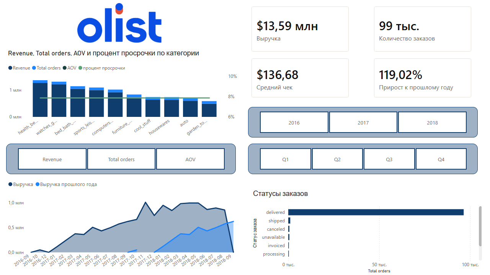
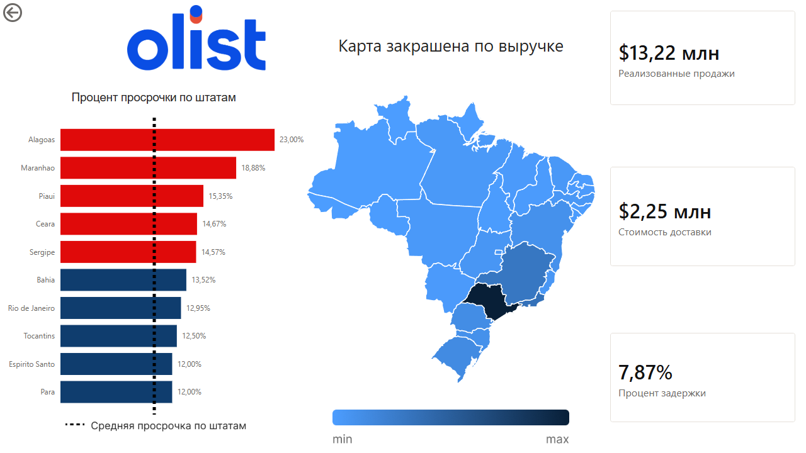
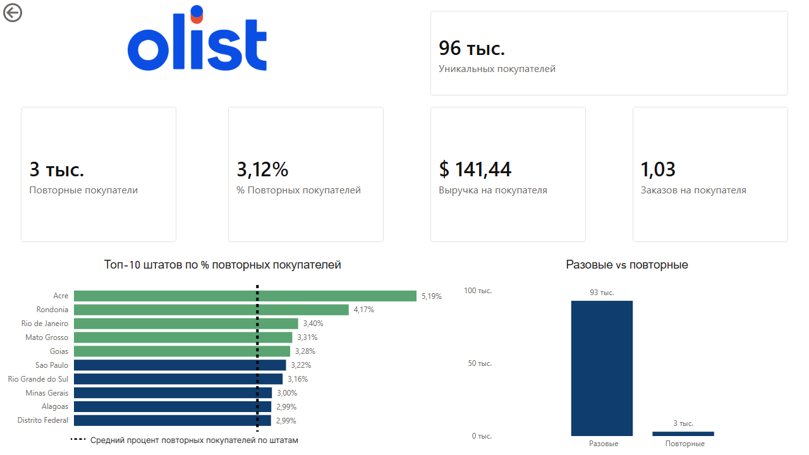

# Brazilian E-Commerce Analytics Dashboard

Интерактивный аналитический дашборд в **Power BI** для комплексного анализа бразильского e-commerce бизнеса на основе открытого датасета **Brazilian E-Commerce Public Dataset by Olist**.

Проект создан для практики работы с Power BI, DAX, Power Query, моделированием данных и построением аналитических визуализаций

---

## О проекте

Цель проекта - получить общий обзор деятельности магазина и проанализировать:

- динамику выручки и количества заказов
- средний чек
- выполнение и задержки заказов
- различия между штатами Бразилии
- клиентскую базу и повторные покупки
- удержание клиентов
- показатели продаж и доставки

Дашборд состоит из **трёх аналитических страниц**

---

## Структура дашборда

### 1. Общий обзор

На первой странице представлен общий обзор бизнеса.

**Основные KPI:**

- Выручка
- Количество заказов
- Средний чек (AOV)
- Изменение выручки относительно прошлого года

Также представлены:

- анализ показателей по категориям товаров
- динамика выручки текущего и предыдущего года
- распределение заказов по статусам
- анализ задержек по категориям
- фильтры по году и кварталу

Для анализа категорий реализован переключатель показателя, позволяющий отображать на диаграмме:

- выручку
- количество заказов
- средний чек



---

### 2. Анализ по штатам

Вторая страница посвящена географическому анализу продаж и качества доставки

Основной элемент страницы - **карта штатов Бразилии**, где интенсивность цвета соответствует объёму выручки

При наведении на штат отображаются дополнительные показатели:

- выручка
- количество заказов
- средний чек

Дополнительно представлены:

- топ-10 штатов с наибольшей долей задержанных заказов
- средний уровень задержки по штатам (пересекает для наглядного сравнения со средним)
- реализованные продажи
- стоимость доставки
- общий процент задержанных заказов

Пять штатов с наиболее высоким уровнем задержек выделены отдельно для более быстрой идентификации проблемных регионов



---

### 3. Клиенты и удержание

Третья страница посвящена анализу клиентской базы и повторных покупок.

**Основные KPI:**

- количество уникальных покупателей
- количество повторных покупателей
- доля повторных покупателей
- выручка на одного покупателя
- количество заказов на одного покупателя

Также представлены:

- топ-10 штатов по доле повторных покупателей
- сравнение разовых и повторных покупателей
- средний показатель повторных покупок по штатам (так же пересекает для наглядности)



---

## Инструменты

- **Power BI** - визуализация и создание дашборда
- **DAX** - расчёт аналитических показателей
- **Power Query** - подготовка и преобразование данных
- **Моделирование данных** - построение связей между таблицами и создание вспомогательных измерений

---

## Модель данных

В проекте использованы таблицы из Brazilian E-Commerce Public Dataset by Olist

Для аналитической модели были созданы дополнительные справочники:

- `Dim_Date` - календарная таблица для корректной работы временной аналитики
- `Dim_state` - справочник для расшифровки кодов штатов Бразилии
- `Buyer Type` - вспомогательная таблица для переключения между разовыми и повторными покупателями

Основные связи между таблицами построены с использованием ключей, предусмотренных исходным датасетом Olist

---

## Примеры DAX

### Average Order Value

```DAX
AOV =
DIVIDE([Revenue], [Total orders], 0)
```

### Доля повторных покупателей

```DAX
Repeat Buyer Rate % =
DIVIDE([Repeat Buyers], [Unique Buyers], 0)
```

### Повторные покупатели

```DAX
Repeat Buyers =
VAR CustomerOrderCounts =
    ADDCOLUMNS(
        VALUES(olist_customers_dataset[customer_unique_id]),
        "@OrdersCount", [Total Orders]
    )
RETURN
    COUNTROWS(
        FILTER(CustomerOrderCounts, [@OrdersCount] > 1)
    )
```

### Рост выручки год к году

```DAX
Revenue YoY % =
VAR PrevYear = [Revenue PY]
VAR CurrentYear = [Revenue]
RETURN
DIVIDE(CurrentYear - PrevYear, PrevYear, 0)
```

### Выручка предыдущего года

```DAX
Revenue PY =
CALCULATE(
    [Revenue],
    SAMEPERIODLASTYEAR(Dim_Date[Date])
)
```

---

## Основные результаты анализа

В ходе анализа были получены следующие наблюдения:

- **Повторные покупатели составляют около 3,12% клиентской базы**, что указывает на очень низкую долю клиентов, совершающих более одной покупки
- В среднем на одного покупателя приходится около **1,03 заказа**, что дополнительно подтверждает преобладание разовых покупок
- Большинство заказов уже доставлено, поэтому **выручка и реализованные продажи находятся на близких уровнях**
- **Сан-Паулу является крупнейшим штатом по объёму выручки**, однако его средний чек относительно низкий, что может быть связано с большим количеством заказов
- В штате **Алагоас около 23% заказов имеют задержку**, что значительно выделяет его среди регионов и может указывать на проблемы с логистикой

---

## Файлы

```text
├── Olist_Dashboard.pbix
├── README.md
├── overview.png
├── states.png
└── customers.png
```

`Olist_Dashboard.pbix` — исходный файл Power BI с моделью данных, DAX-расчётами и визуализациями.

Исходный датасет является открытым и доступен через Kaggle.

---

## Цель проекта

Основная цель проекта - практическое применение Power BI для решения аналитической задачи: от построения модели данных и создания DAX-мер до разработки интерактивного дашборда и интерпретации полученных результатов

Проект является частью портфолио и демонстрирует практические навыки работы с **Power BI, DAX, Power Query и моделированием данных**
